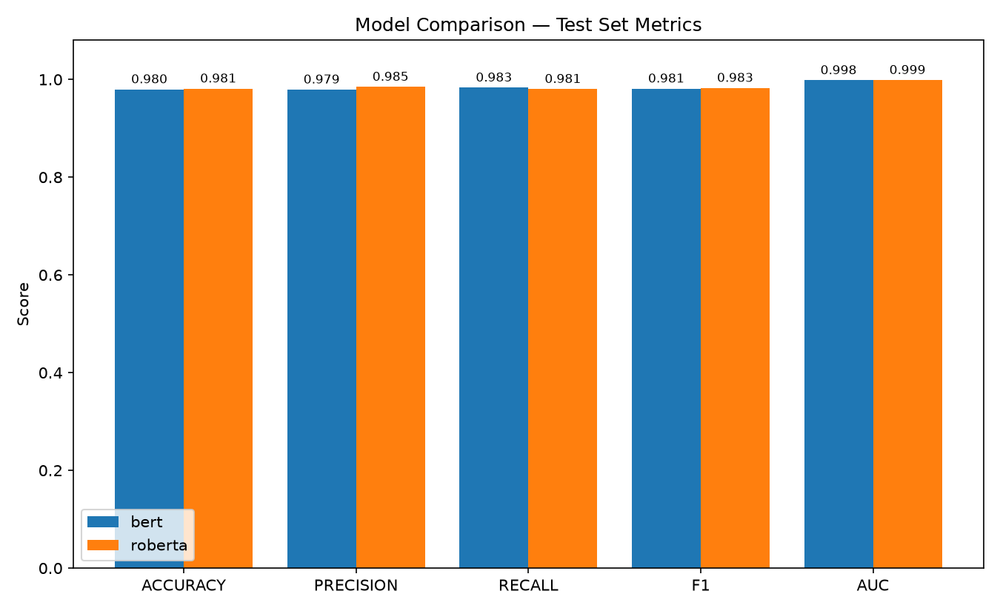

# Fake News Detector

> BERT and RoBERTa fine-tuned for binary fake news classification — **98.15% accuracy · 98.28% F1 · 0.9988 AUC** (RoBERTa-base, best model)

Standard full fine-tuning of `bert-base-uncased` and `roberta-base` on a unified GossipCop + PolitiFact + LIAR corpus, trained locally on a single consumer GPU (RTX 4070, 12GB VRAM).

---

## Results

| Model | Accuracy | Precision | Recall | F1 | AUC-ROC |
|---|---|---|---|---|---|
| BERT-base-uncased | 97.99% | 97.94% | 98.35% | 98.15% | 0.9984 |
| **RoBERTa-base** | **98.15%** | **98.51%** | 98.06% | **98.28%** | **0.9988** |

RoBERTa outperforms BERT on every metric except recall, where BERT is marginally ahead. Full evaluation artifacts (confusion matrices, ROC curves, classification reports) are in [`evaluate_outputs/`](evaluate_outputs/).



Test set: 4,482 held-out examples, stratified from the same distribution as training.

---

## Method

This project uses **standard full fine-tuning** — all encoder layers trainable from step one — rather than progressive/layer-frozen training schemes. On a 12GB consumer GPU at `max_length=128`, both `bert-base-uncased` and `roberta-base` fit comfortably at batch size 32 with mixed precision, so no gradient checkpointing, layer-freezing, or gradual unfreezing was necessary.

**Hyperparameters** (`src/config.py`):

| Setting | Value |
|---|---|
| Max sequence length | 128 |
| Batch size | 32 |
| Epochs | 4 (early stopping patience 2, monitored on val F1) |
| Learning rate | 2e-5 |
| Weight decay | 0.01 |
| Warmup ratio | 0.1 |
| Mixed precision | FP16 |

> **Note:** an earlier iteration of this project explored *Sequential Parameter Switch Training (SPST)* — a progressive layer-unfreezing scheme for training BERT within severe memory constraints (e.g. free-tier Colab GPUs). That approach is documented separately; this repository's current training path is the simpler standard fine-tuning approach above, since local GPU memory is not a binding constraint here.

---

## Dataset

Unified corpus combining three sources into a single binary-labeled (`fake`=0, `real`=1) format:

| Source | Content |
|---|---|
| GossipCop | Entertainment news (scraped article text) |
| PolitiFact | Political fact-checks (scraped article text) |
| LIAR | Short political statements (six-way labels collapsed to binary) |

| Split | Examples | Fake | Real |
|---|---|---|---|
| Train | 35,850 | 16,478 | 19,372 |
| Val | 4,481 | 2,060 | 2,421 |
| Test | 4,482 | 2,060 | 2,422 |

Dataset details and provenance: see the companion dataset repository README.

---

## Repository Structure

```
├── datasets/
│   ├── datasets/
│   │   ├── raw/                       # Original per-source TSVs
│   │   └── processed/                 # unified_{train,val,test}.tsv
│   └── datasets.zip
├── models/
│   ├── bert/                          # Fine-tuned BERT weights + tokenizer + results.json
│   └── roberta/                       # Fine-tuned RoBERTa weights + tokenizer + results.json
├── logs/
│   ├── bert/checkpoints/              # Trainer checkpoints
│   └── roberta/checkpoints/
├── evaluate_outputs/
│   ├── bert/                          # metrics.json, confusion_matrix.png, roc_curve.png, classification_report.txt
│   ├── roberta/
│   └── comparison/                    # metrics_comparison.csv / .png
├── gradio_ui/                         # Inference demo app
│   ├── app.py
│   ├── components.py
│   ├── explain.py
│   ├── extract.py
│   └── inference.py
├── src/
│   ├── config.py                      # Paths, model configs, hyperparameters
│   ├── training/
│   │   ├── dataset.py                 # Loads + tokenizes unified TSVs
│   │   └── train.py                   # Standard fine-tuning entry point
│   └── evaluate/
│       ├── evaluate.py                # Per-model test-set evaluation + plots
│       └── compare.py                 # Cross-model comparison chart/table
├── train_bert_colab.ipynb             # Colab notebook (legacy / optional)
└── requirements.txt
```

---

## Reproduce

### 1. Setup

```bash
git clone https://github.com/premananda-cloud/fake_news_detector
cd fake_news_detector
pip install -r requirements.txt
```

### 2. Dataset

Unzip `datasets/datasets.zip` so that `datasets/datasets/processed/unified_train.tsv` (and val/test) exist. See the dataset repository for the standalone corpus if starting fresh.

### 3. Train

```bash
python -m src.training.train --model bert
python -m src.training.train --model roberta
```

Each run saves the best checkpoint (by validation F1) to `models/<name>/`, along with a `results.json` test-set summary.

### 4. Evaluate

```bash
python -m src.evaluate.evaluate --model bert
python -m src.evaluate.evaluate --model roberta
python -m src.evaluate.compare
```

Produces per-model confusion matrices, ROC curves, classification reports, and a side-by-side comparison chart in `evaluate_outputs/`.

### 5. Try it out

```bash
python gradio_ui/app.py
```

---

## Requirements

```
torch
transformers>=4.40.0
datasets
scikit-learn
pandas
numpy
accelerate>=1.1.0
matplotlib
seaborn
```

> Tested against `transformers==5.15.1`. If using an older `transformers` (4.x) install, note that some `TrainingArguments` field names differ (e.g. `warmup_ratio` was removed in v5.0 in favor of computing `warmup_steps` directly) — `src/training/train.py` detects and adapts to either.

---

## Hardware

Trained and evaluated on a single NVIDIA RTX 4070 (12GB VRAM), CUDA 13.2. Full fine-tuning of either base model at batch size 32 / `max_length=128` / FP16 comfortably fits within this budget.

---

## License

MIT
